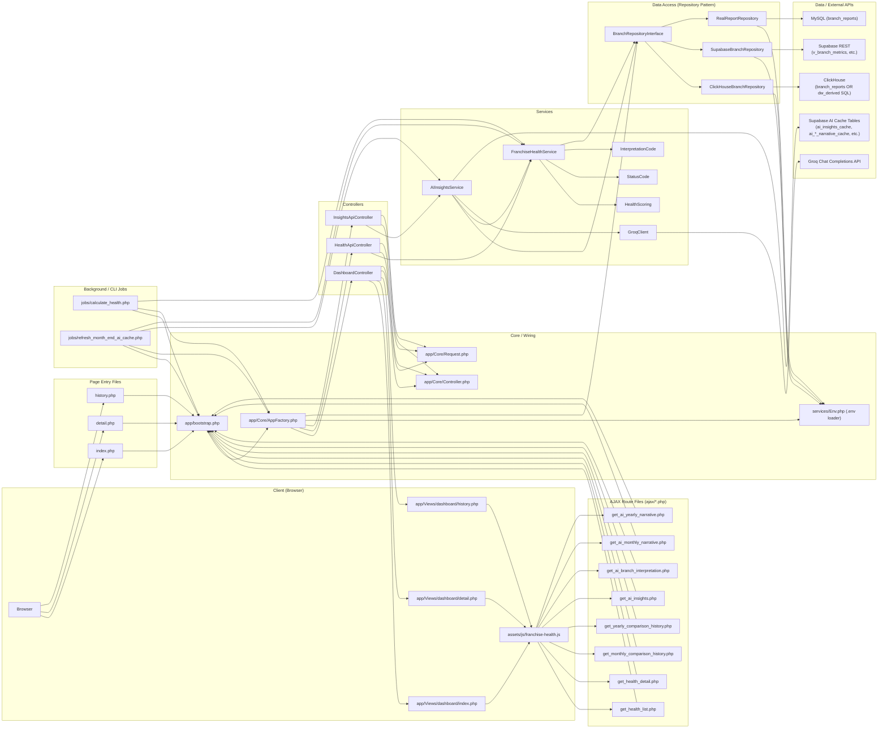
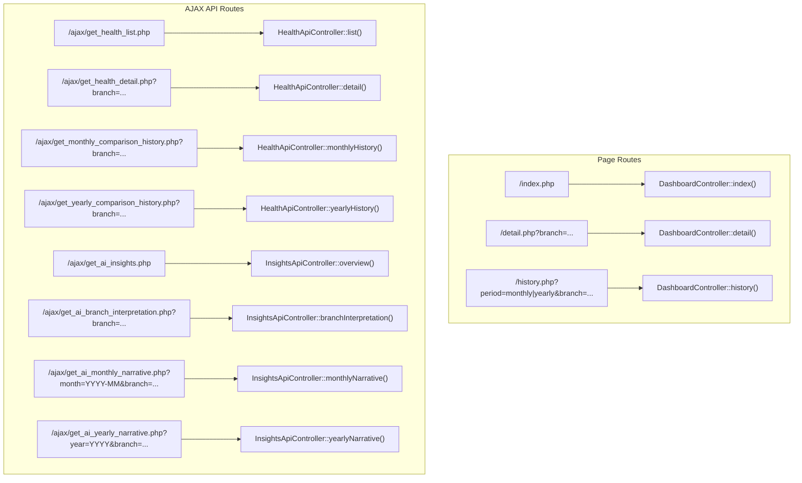
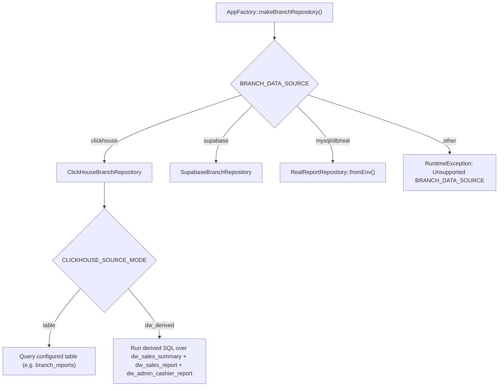
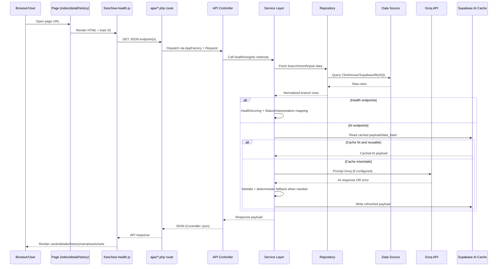

# Franchise Health System Flow Diagram

This document maps how pages, routes, controllers, services, repositories, AI, and data sources connect.

## 1) End-to-End Architecture

## 2) Route-to-Controller Map

## 3) Data Source Selection Logic

## 4) Main Runtime Sequences

